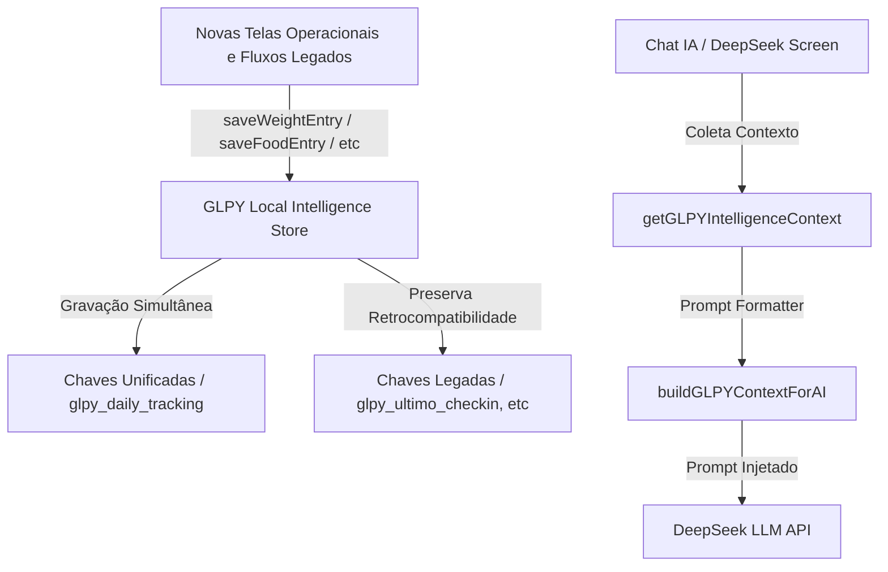

# GLPY Local Intelligence Store (v1)

O **GLPY Local Intelligence Store** é a camada centralizada de inteligência local, projetada para compilar, consolidar e formatar toda a jornada do usuário e logs diários de saúde, fornecendo esse contexto de forma dinâmica ao **Chat IA (DeepSeek)**.

Esta camada funciona de forma totalmente síncrona e persistida no `localStorage`, servindo como uma ponte robusta entre as telas operacionais e o modelo de IA, sem depender de sincronização ativa com o Firestore/Firebase no MVP.

---

## 1. Arquitetura e Fluxo de Dados



A arquitetura foi projetada sob o princípio da **tolerância a falhas (Fault Tolerance)**:
- Toda operação de parsing/stringifying utiliza blocos `try/catch`.
- Chaves corrompidas ou ausentes são tratadas de forma elegante, retornando fallbacks seguros (como arrays vazios ou valores nulos) sem estourar exceções em tempo de execução.
- Indexação por data (`YYYY-MM-DD`) permitindo time-series metabólico local.

---

## 2. Modelos de Dados (Typescript Interfaces)

As seguintes interfaces definem os dados manipulados e armazenados pela camada de inteligência:

```typescript
export interface WeightEntry {
  weight: number;
  date?: string;       // YYYY-MM-DD (Default: hoje)
  timestamp?: string;  // ISO 8601
}

export interface WaterEntry {
  amount: number;      // Litros a somar
  date?: string;
  timestamp?: string;
}

export interface FoodEntry {
  prato: string;
  kcal: number;
  proteina: number;
  carbs: number;
  gordura: number;
  image?: string;      // Base64 ou URL local
  date?: string;
  timestamp?: string;
}

export interface InjectionEntry {
  dose: string;        // ex: "0.25mg"
  local: string;       // ex: "Abdômen Esquerdo"
  symptomsAfter?: string[];
  date?: string;
  timestamp?: string;
}

export interface SymptomsEntry {
  symptoms: string[];
  severity?: Record<string, number>;
  date?: string;
  timestamp?: string;
}

export interface EmotionEntry {
  emotion: string;     // ex: "Animado", "Ansioso"
  notes?: string;
  date?: string;
  timestamp?: string;
}

export interface ActivityEntry {
  type: string;        // ex: "Caminhada"
  duration: number;    // Minutos
  intensity: string;   // "Leve" | "Moderada" | "Alta"
  kcalBurned?: number;
  date?: string;
  timestamp?: string;
}

export interface BodyMeasurementsEntry {
  waist?: number;      // Cintura (cm)
  hip?: number;        // Quadril (cm)
  chest?: number;      // Peitoral (cm)
  arms?: number;       // Braços (cm)
  date?: string;
  timestamp?: string;
}

export interface PhotoProgressEntry {
  image: string;       // Base64 ou link
  tag: string;         // ex: "Frente", "Lado"
  date?: string;
  timestamp?: string;
}

export interface CheckInEntry {
  fome: number;        // 1-10
  saciedade: number;   // 1-10
  humor: number | string;
  sintomas: string[];
  enjoo?: number;
  fraqueza?: number;
  energia?: number;
  peso?: number | string;
  date?: string;
  timestamp?: string;
}

export interface ProtocolContextEntry {
  id: string;
  nome: string;
  emoji: string;
  totalDias: number;
  dia: number;
  missoesConcluidas?: number;
  missoesTexto?: string[];
}

export interface ProtocolDayMission {
  id: string;
  texto: string;
  sub?: string;
  status: "concluida" | "pendente";
}

export interface ProtocolDayRecipe {
  id: number | string;
  emoji?: string;
  nome: string;
  kcal?: number;
  proteina?: number;
  carbs?: number;
  gordura?: number;
  categoria?: string;
}

export interface ProtocolDayTrackingEntry {
  protocolId: string;
  protocolName: string;
  protocolEmoji?: string;
  totalDays: number;
  day: number;
  date?: string;
  timestamp?: string;
  missions?: ProtocolDayMission[];
  selectedCheckins?: string[];
  recipeOfDay?: ProtocolDayRecipe | null;
  dayStatus?: "em_andamento" | "concluido" | "bloqueado" | "pendente";
  xpEarned?: number;
  behavioralSignals?: string[];
}

export interface DailyTrackingDay {
  date: string;        // YYYY-MM-DD
  weight?: number;
  water?: number;
  meals?: FoodEntry[];
  injections?: InjectionEntry[];
  symptoms?: string[];
  emotion?: string;
  activity?: ActivityEntry[];
  measurements?: BodyMeasurementsEntry;
  checkin?: CheckInEntry;
  protocolDay?: ProtocolDayTrackingEntry;
}
```

---

## 3. Chaves do LocalStorage e Estratégia de Retrocompatibilidade

Para evitar qualquer quebra visual ou comportamental nas telas legadas do aplicativo, a camada grava simultaneamente nas chaves legadas e nas chaves do novo sistema centralizado.

| Chave de Armazenamento | Tipo / Formato | Destino / Utilidade | Legada / Compatibilidade |
| :--- | :--- | :--- | :--- |
| `glpy_daily_tracking` | `Record<string, DailyTrackingDay>` | Dicionário indexado por data (`YYYY-MM-DD`) contendo logs metabólicos consolidados. | **Nova** |
| `glpy_latest_weight` | `WeightEntry` | Último peso registrado de forma estruturada. | **Nova** |
| `glpy_peso_atual` | `string` (ex: `"72.5"`) | Peso para telas legadas. | **Legada** |
| `glpy_weight_history` | `WeightEntry[]` | Histórico dos últimos 100 registros de peso. | **Nova** |
| `glpy_today_water` | `WaterEntry` | Logs de água do dia. | **Nova** |
| `glpy_today_food` | `FoodEntry[]` | Alimentos consumidos hoje. | **Nova** |
| `glpy_fotos_historico` | `Array<{ prato, kcal, proteina, data, image }>` | Histórico legado de fotos com metadados. | **Legada** |
| `glpy_latest_injection` | `InjectionEntry` | Registro mais recente da injeção de GLP-1. | **Nova** |
| `glpy_injection_history` | `InjectionEntry[]` | Lista com histórico de aplicações. | **Nova** |
| `glpy_today_symptoms` | `SymptomsEntry` | Sintomas reportados hoje. | **Nova** |
| `glpy_symptoms_history` | `SymptomsEntry[]` | Histórico de sintomas de saúde. | **Nova** |
| `glpy_today_emotion` | `EmotionEntry` | Estado emocional/humor registrado hoje. | **Nova** |
| `glpy_emotion_history` | `EmotionEntry[]` | Histórico de humor. | **Nova** |
| `glpy_today_activity` | `ActivityEntry[]` | Atividades físicas registradas hoje. | **Nova** |
| `glpy_activity_history` | `ActivityEntry[]` | Histórico de atividades físicas. | **Nova** |
| `glpy_latest_measurements` | `BodyMeasurementsEntry` | Medidas corporais mais recentes. | **Nova** |
| `glpy_measurements_history` | `BodyMeasurementsEntry[]` | Histórico de medidas físicas. | **Nova** |
| `glpy_photo_progress` | `PhotoProgressEntry[]` | Registros visuais da evolução do corpo. | **Nova** |
| `glpy_ultimo_checkin` | `CheckInEntry` (Formato Legado) | Último check-in completo (lido diretamente pela lógica do `ChatIA.tsx`). | **Legada** |
| `glpy_checkin_history` | `CheckInEntry[]` | Histórico dos check-ins diários. | **Nova** |
| `glpy_protocolo_ativo` | `ProtocolContextEntry` | Informações legadas sobre o protocolo corrente. | **Legada** |
| `glpy_current_protocol_day` | `string` (ex: `"4"`) | Dia atual do protocolo em string. | **Legada** |
| `glpy_missoes_texto_hoje` | `string[]` | Missões diárias recomendadas. | **Legada** |
| `glpy_protocol_context` | `ProtocolContextEntry` | Objeto completo estruturado do protocolo. | **Nova** |
| `glpy_protocol_day_today` | `ProtocolDayTrackingEntry` | Execução do protocolo no dia: missões concluídas/pendentes, check-in selecionado, receita do dia e status. | **Nova** |
| `glpy_protocol_day_history` | `ProtocolDayTrackingEntry[]` | Histórico das execuções diárias de protocolo, deduplicado por data/protocolo/dia. | **Nova** |
| `glpy_results_summary` | `Record<string, any>` | Consolidação de resultados (peso perdido, fotos totais, etc.). | **Nova** |

---

## 4. Métodos Públicos da API

Abaixo está o descritivo de consumo da biblioteca importável em `src/core/glpyLocalIntelligence.ts`:

### Métodos de Escrita (Mutadores)
- **`saveWeightEntry(entry: WeightEntry): void`**: Salva o peso atual e atualiza a evolução e resumos de resultados.
- **`saveWaterEntry(entry: WaterEntry): void`**: Registra e acumula ingestão de água diária.
- **`saveFoodEntry(entry: FoodEntry): void`**: Adiciona uma refeição do dia, incluindo suporte a imagens e cálculo metabólico.
- **`saveInjectionEntry(entry: InjectionEntry): void`**: Registra uma dose e local de injeção de GLP-1 (Ozempic/Saxenda/etc).
- **`saveSymptomsEntry(entry: SymptomsEntry): void`**: Consolida sintomas diários para análise metabólica.
- **`saveEmotionEntry(entry: EmotionEntry): void`**: Registra o humor e notas emocionais.
- **`saveActivityEntry(entry: ActivityEntry): void`**: Registra atividades físicas executadas hoje.
- **`saveBodyMeasurementsEntry(entry: BodyMeasurementsEntry): void`**: Registra medidas da fita métrica (cintura, quadril).
- **`savePhotoProgressEntry(entry: PhotoProgressEntry): void`**: Salva evolução visual (fotos do prato ou do corpo).
- **`saveCheckInEntry(entry: CheckInEntry): void`**: Salva o check-in metabólico diário completo (fome, saciedade, humor, energia, peso, etc).
- **`saveProtocolContext(entry: ProtocolContextEntry): void`**: Define o protocolo atual, dia corrente e missões a serem perseguidas.
- **`saveProtocolDayTracking(entry: ProtocolDayTrackingEntry): void`**: Salva a execução do protocolo do dia atual, incluindo status das missões, check-in selecionado, receita do dia, status do dia e sinais comportamentais.

> [!IMPORTANT]
> Missões concluídas são gravadas como **sinais comportamentais** em `behavioralSignals`. Elas **não** incrementam consumo nutricional. Calorias, proteínas, carboidratos, gorduras e água consumidos continuam vindo somente de `saveFoodEntry()`, `saveWaterEntry()` e futuros fluxos reais de refeição/foto do prato.

### Métodos de Leitura & Agregação (Leitores)
- **`getGLPYIntelligenceContext()`**: Consolida de forma reativa e compilada todos os dados de saúde, perfil, evolução física, registros metabólicos diários e logs clínicos do usuário. Adiciona automaticamente uma lista de **warnings (alertas de dados ausentes)** se o usuário deixar de registrar logs fundamentais (como peso, água, refeições ou injeções).
- **`buildGLPYContextForAI(): string`**: Pega a saída consolidada do agregador e monta um **bloco de prompt textual estruturado e legível por LLMs**. Esse bloco de prompt é então injetado no prompt de sistema ou histórico da IA, fornecendo o "prontuário clínico e metabólico" em tempo real para o DeepSeek adaptar seu tom de aconselhamento de forma impecável.

---

## 5. Exemplo Prático de Prompt Injetado na IA

Abaixo está a estrutura real e formatada gerada por `buildGLPYContextForAI()` quando há registros parciais salvos:

```text
=== GLPY LOCAL INTELLIGENCE STORE ===

Usuário: Cleison (Plano: STARTER)
Streak: 5 dias 🔥 | XP: 340 (Nível 2)

Protocolo Ativo: Anti-Rebote — Dia 4/7
Execução do Protocolo Hoje: em_andamento
Missões de hoje:
  1. [x] Jejum metabólico de 12 horas
  2. [ ] Consumir 2.5L de água pura
  3. [ ] Evitar ultraprocessados à noite
Check-in do protocolo: Nenhuma compulsão hoje
Receita do dia: Frango com Batata-Doce (420 kcal, 42g prot)
Sinais comportamentais: Missão concluída: Jejum metabólico de 12 horas; Check-in selecionado: Nenhuma compulsão hoje

Peso Atual: 78.2 kg (Emagreceu total de 1.8 kg desde o início)

Última Injeção GLP-1: Dose 0.5mg no local Abdômen Esquerdo em 2026-05-18

Logs Metabólicos de Hoje:
- Ingestão de Água: 1.5L consumidos
- Refeições Hoje:
  * Omelete com Espinafre: 320 kcal, 24g prot, 3g carb, 18g gord
  * Salada de Frango Grelhado: 450 kcal, 40g prot, 12g carb, 10g gord
- Exercícios Hoje:
  * Caminhada por 30 min (Leve)

Status Clínico & Emocional de Hoje:
- Sintomas: Leve Enjôo, Cansaço
- Humor/Estado: Focado

Lembretes/Lacunas Clínicas:
  [!] Registro de hidratação ainda incompleto para a meta do dia.

IMPORTANTE: Adapte seu tom médico-comportamental e nutricional a esses dados unificados acima para guiar suas respostas.
```

---

## 6. Integração Futura com Firebase/Firestore

Quando o backend for ativado e a sincronização cloud for necessária, a camada local servirá como **Buffer de Escrita Off-line (Write-Ahead Log)**. 
Bastará criar um serviço observador (listener) que sincronize a chave estruturada `glpy_daily_tracking` e chaves históricas (`glpy_weight_history`, `glpy_injection_history`) para o banco de dados remoto quando a conexão estiver ativa, assegurando zero perda de dados metabólicos e experiência offline impecável.
